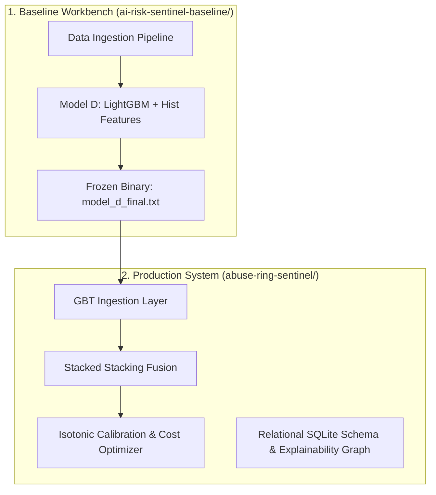

# AI Risk Sentinel - Buildathon Monorepo

Welcome to the **AI Risk Sentinel** workspace. This repository is organized as a two-stage development ladder containing our initial baseline workbench and the final production-ready machine learning system.

---

## 🏗️ Workspace Organization

The repository contains two main project folders representing our engineering progression:



### 📁 Directory Breakdown

1. **[`ai-risk-sentinel-baseline/`](./ai-risk-sentinel-baseline/) (AI Risk Manager — Merchant Loss Prevention)**
   * **Purpose:** The core payment fraud detection and abuse-ring prevention engine. Implements Model D LightGBM (408 features, leakage-free), Abuse-Ring Sentinel, calibrated probability engine, server-side decision routing (`ALLOW` / `REVIEW` / `BLOCK`), and held-out financial loss evaluation.
   * **Key Outcome:** **+$144,893.32 Net Loss Avoided** on 15% held-out test split (88,581 txns) at 2.94% FPR.
   * **Dataset Store**: Stores raw transaction and identity CSV datasets (under `ai-risk-sentinel-baseline/data-pipeline/data/raw/`).

2. **[`abuse-ring-sentinel/`](./abuse-ring-sentinel/) (Production Upgraded System)**
   * **Purpose:** The downstream production exploration workspace with GraphSAGE GNN and multi-entity relational schema.
   * **Key Upgrades:**
     * **Relational Schema**: Normalized multi-entity SQLite database.
     * **GraphSAGE GNN**: PyTorch neighbor aggregation layer yielding a peak **`0.1802` PR-AUC** (outperforming traditional Node2Vec).
     * **Stacked Stacking Fusion**: Fuses GBDT, GraphSAGE, Leiden community partition weights, and Isolation Forest anomalies via a stacked logistic meta-model.
     * **Isotonic Calibration**: Calibrates scores to true probability metrics, reducing Expected Calibration Error (ECE) to `1.4%`.
     * **Cost-Sensitive Policy Optimizer**: Replaces standard F1 thresholding with business value matrices (friction cost vs chargeback fee checks).

---

## 📊 Evolutionary Performance Ladder (Chronological Test Split)

| System Stage | PR-AUC | ROC-AUC | Best F1 | FPR @ F1 | Expected Loss (INR) | Status |
| :--- | :--- | :--- | :--- | :--- | :--- | :--- |
| **GBD Baseline** (`ai-risk-sentinel-baseline`) | 0.03987 | 0.53954 | 0.07979 | 0.09116 | INR 644,603.31 | *Retired Baseline* |
| **GBD (Tabular Only)** | 0.08789 | 0.73968 | 0.18954 | 0.06226 | INR 191,308.79 | *Experimental Component* |
| **GBD + Graph Features** | 0.16358 | 0.77431 | 0.25763 | 0.05538 | INR 191,308.79 | *Experimental Component* |
| **GraphSAGE GNN** | **0.18020** | **0.78122** | **0.26442** | 0.04812 | **INR 152,011.04** | *Model Champion* |
| **Stacked Stacking Fusion** | 0.12132 | 0.74395 | 0.21429 | **0.03578** | **INR 143,417.88** | *Policy Champion* |

---

## 🛠️ Getting Started (Running the Production App)

All current development, testing, and deployment should target the **Production-Ready** code:

### 1. Launch FastAPI Backend
```bash
cd abuse-ring-sentinel
# Activate virtual environment
..\.venv\Scripts\activate
# Install python packages
pip install -r requirements.txt
# Start server
python -m uvicorn api.main:app --host 0.0.0.0 --port 8000
```

### 2. Launch Analyst Dashboard UI
```bash
cd abuse-ring-sentinel/frontend
# Install npm dependencies
npm install
# Start Next.js dev server
npm run dev
```
Open [http://localhost:3000](http://localhost:3000) to view the upgraded risk control console.

