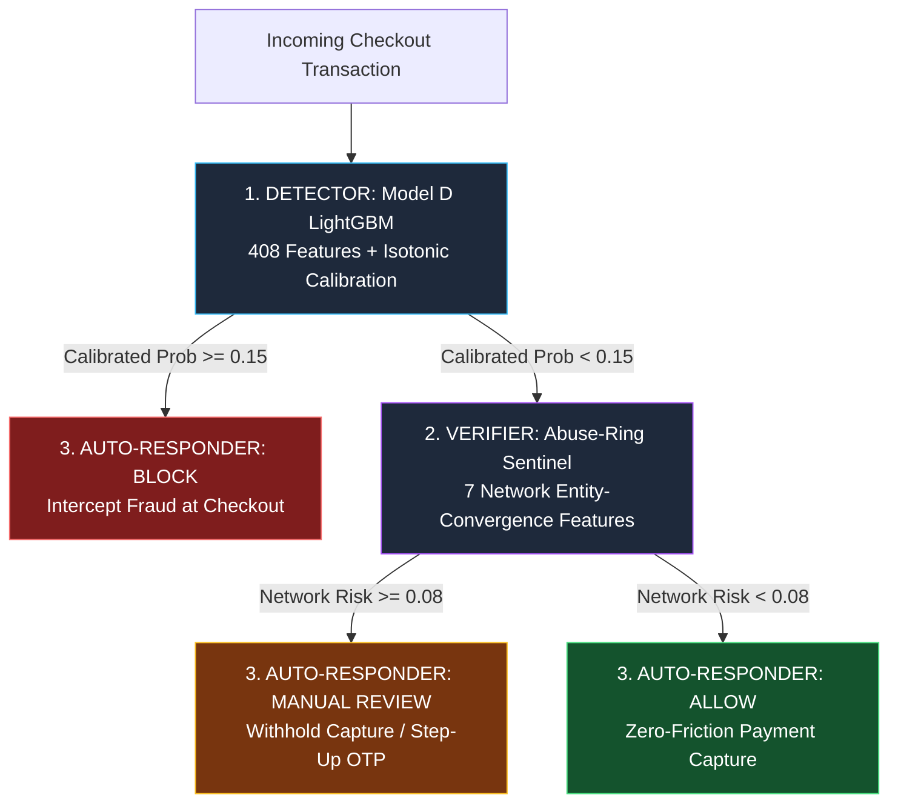

# AI Risk Sentinel — AI Risk Manager for Merchant Fraud Loss Prevention

> **Track**: AI Risk Manager  
> **Single Class of Loss**: **Payment Fraud & Coordinated Abuse Rings**  
> **Core Thesis**: Detect suspicious transactions, verify coordinated multi-entity abuse networks, and execute automated defensive actions to maximize **Net Merchant Loss Avoided ($)** while strictly bounding false-positive customer friction.

---

## 🏗️ System Architecture: Defense-in-Depth

The platform operates as a modular, three-tier merchant fraud defense system:



### 1. Detector: Model D LightGBM
* **Scope**: Individual transaction anomaly detection.
* **Feature Vector**: 408 features spanning transaction telemetry, distance and address matching, and Bayesian-smoothed historical card frequencies.
* **Leakage-Free**: Raw `TransactionDT` has been completely eliminated and replaced with 6 stationary cyclical features (`hour_of_day`, `day_of_week`, `hour_sin`, `hour_cos`, `day_of_week_sin`, `day_of_week_cos`).
* **Calibration**: Isotonic regression calibrator maps tree logits to true posterior probabilities on held-out chronological data.

### 2. Verifier: Abuse-Ring Sentinel
* **Scope**: Secondary network-level verification for transactions that pass initial screening.
* **Feature Vector**: 7 multi-entity coordination signals (device card counts, billing address card counts, email reuse, 72-hour card convergence, device/address historical fraud exposure rates, and cross-entity overlap hubs).
* **Weak Supervision**: Identifies fraud rings executing multi-card trial velocity and device rotation.

### 3. Auto-Responder: Decision Engine
* **Policy**: Bounded false-positive rate constraint ($\text{FPR} < 3.0\%$) with validation-optimized operating thresholds:
  * **BLOCK**: $\hat{p}_{\text{detector}} \ge 0.15000$ (Immediate checkout interception)
  * **MANUAL REVIEW**: $\hat{p}_{\text{verifier}} \ge 0.08000$ (Pre-capture hold or step-up authentication)
  * **ALLOW**: Both models below thresholds (Instant automated capture)
* **Explainability**: Deterministic risk reason codes generated at runtime from observable telemetry without reference to ground-truth labels.

---

## 💰 Held-Out Test Set Financial Evaluation

The entire architecture is evaluated on a strictly locked **15% chronological held-out test split** (88,581 transactions, $12,148,754.19 total checkout volume). The test set spans the final time period and was never seen during model training, feature target encoding, or threshold optimization.

### Economic Cost Model
* **Fraud Loss Cost**: 100% of transaction amount if fraudulent transaction is captured ($L = \text{Amount}$).
* **False Positive Friction Cost Rate**: 15% of transaction amount representing merchant margin loss, interchange fees, and customer churn penalty ($C_{\text{FP}} = 0.15 \times \text{Amount}$).
* **Net Loss Avoided ($)**: $\text{Fraud Loss Prevented} - \text{False Positive Friction Cost}$.

### Locked Test Set Results

| Financial & Operating Metric | Held-Out Test Result (15% Split) | Operational Objective | Status |
| :--- | :---: | :---: | :---: |
| **Total Test Transactions** | **88,581** | Full Held-Out Split | Locked |
| **Total Test Checkout Volume** | **$12,148,754.19** | - | - |
| **Baseline Fraud at Risk** | **$469,608.52** (3,083 txns) | Baseline Exposure | Measured |
| **Direct Fraud Loss Prevented** | **$218,964.73** | Maximize Prevention | Captured |
| **Fraud Value Capture Rate** | **46.63%** | Maximize Capture | Captured |
| **False Positive Volume Blocked** | **$493,809.36** (2,510 txns) | Minimize Disruption | Controlled |
| **False Positive Friction Cost (15%)** | **$74,071.40** | Penalty Subtracted | Controlled |
| **Net Financial Loss Avoided** | **+$144,893.32** | $> $0 Net Merchant Savings | **Exceeded** |
| **Test Set False Positive Rate (FPR)** | **2.94%** | $\le 3.00\%$ Business Ceiling | **Satisfied** |
| **Fraud Precision** | **40.95%** | High Quality Blocks | Measured |
| **Model D ROC-AUC** | **0.8892** | Ranking Discrimination | High |
| **Model D PR-AUC** | **0.5122** | Precision-Recall Area | High |
| **Sentinel Reviewed Fraud Cases** | **1,339 txns** ($250,643.79) | High-Risk Catchment | Routed |

---

## 🔬 Methodological Integrity & Leakage Prevention

This repository strictly adheres to causal ML practices to prevent common benchmark pitfalls:

1. **Stationary Temporal Representation**:
   * Raw monotonic `TransactionDT` was removed from the feature matrix. Tree algorithms split on raw timestamps create split boundaries that fail to generalize to future unseen time horizons.
   * Replaced with 6 stationary cyclical features (`hour_of_day`, `day_of_week`, sine/cosine encodings) that generalize indefinitely into future transactions.
2. **Causal Historical Target Encodings**:
   * Expanding target encodings and entity frequencies are calculated strictly from past transactions ($t < \text{current\_dt}$).
   * The historical split boundary is aligned to the 70% training split, preventing lookahead leakage into the validation and test splits.
3. **Probability Calibration**:
   * Raw gradient-boosted decision tree outputs are distorted by class imbalance and log-loss objectives.
   * An isotonic regression calibrator fitted on the chronological development split aligns predicted probabilities with true observed empirical frequencies.
4. **Separation of Model Decisions from Ground Truth**:
   * Ground truth (`isFraud`) is strictly quarantined for offline audit and evaluation reporting.
   * Runtime decision routing (`make_decision()`) and deterministic explainability (`explain_risk()`) operate exclusively on observable transaction features and calibrated probabilities.

---

## 📁 Repository Directory Structure

```text
ai-risk-sentinel-baseline/
├── README.md                      # This file (executive architecture & results)
├── PROJECT_GUIDE.md               # Detailed directory guide with relative links
├── CLAUDE.md                      # CLI commands cheatsheet
├── experiments_summary.md         # Historical experiment logs & ablation records
└── data-pipeline/                 # Python Data Engineering Pipeline & API Server
    ├── requirements.txt           # Python dependencies
    ├── pipeline/
    │   ├── risk_engine.py         # Decision routing, loss evaluation & explainability
    │   ├── preprocess.py          # Data ingestion, entity graph generation & SQLite DB
    │   ├── build_merged_dataset.py# Chronological table merger
    │   ├── download.py            # IEEE-CIS Kaggle downloader
    │   ├── audit.py               # Data audit & integrity checks
    │   └── schema.sql             # Relational SQLite schema
    ├── features/
    │   ├── transaction_features.py# 408 baseline features (no TransactionDT)
    │   ├── historical_features.py # Leakage-free Bayesian expanding encodings
    │   ├── abuse_ring_features.py # 7 secondary Sentinel features
    │   ├── card_novelty_features.py# Card issuance timelines
    │   ├── deviation_features.py  # Behavioral deviations
    │   └── graph_features.py      # Entity graph overlap metrics
    ├── models/
    │   ├── model_d_final.txt      # Frozen 408-feature LightGBM detector booster
    │   ├── abuse_ring_sentinel_final.txt # Frozen 7-feature Sentinel verifier booster
    │   ├── model_d_calibrator.joblib # Isotonic probability calibrator
    │   ├── thresholds.json        # Validation-optimized operating thresholds
    │   ├── test_metrics.json      # Locked held-out test evaluation metrics
    │   ├── model_d_features.json  # Detector feature schema (408 features)
    │   └── sentinel_features.json # Verifier feature schema (7 features)
    ├── app/
    │   ├── sentinel_app.py        # FastAPI server & interactive audit portal
    │   └── sentinel_demo.py       # Terminal simulation demo
    ├── research/
    │   └── train_final_models.py  # End-to-end training, calibration & test evaluation
    └── validation/
        ├── test_causal_integrity.py # Automated leakage and temporal tests
        └── validate_sentinel_routing.py # Routing verification script
```

---

## 🚀 Quickstart & Reproducibility

### 1. Environment Setup
```powershell
cd data-pipeline
python -m venv .venv
.venv\Scripts\activate
pip install -r requirements.txt
```

### 2. Verify Causal Integrity (Automated Tests)
Runs automated assertions verifying that raw `TransactionDT` is excluded from feature sets, target encodings respect chronological boundaries, and risk decision engine operates strictly without ground-truth:
```powershell
python validation/test_causal_integrity.py
```

### 3. Retrain Models & Evaluate Held-Out Test Set
Trains Model D (408 features), trains Sentinel (7 features), fits probability calibrator on validation split, optimizes operating thresholds for net financial loss avoidance, and outputs test set evaluation:
```powershell
python research/train_final_models.py
```

### 4. Launch Live Inference & Verifiable Audit Portal
Starts the FastAPI application serving the interactive live audit portal and REST endpoints at `http://127.0.0.1:8000`:
```powershell
python app/sentinel_app.py
```

### 5. API Endpoints
* `GET /api/metrics/merchant-impact`: Returns held-out test set financial impact metrics (net loss avoided, fraud prevented, FPR, ROC/PR AUC).
* `GET /api/lookup?transaction_id={id}`: Looks up pre-indexed test transaction telemetry and ground truth for audit.
* `POST /api/analyze`: Scores transaction through calibrated Model D and Sentinel, applies server-side decision routing, generates deterministic risk reason codes, and performs real-time chronological network auditing.
