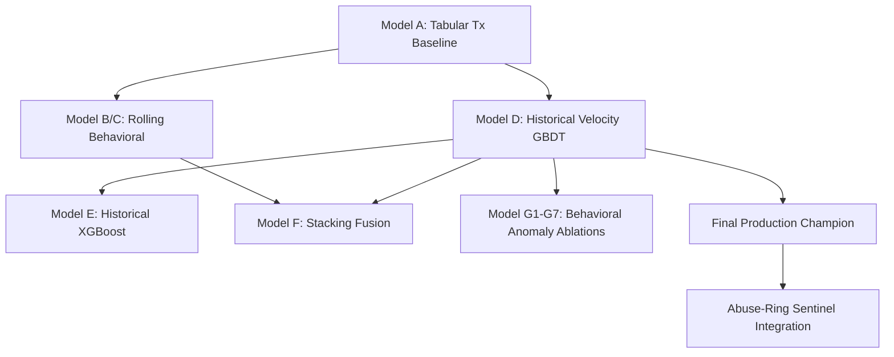

# AI Risk Sentinel - Baseline Experiments & Decision Summary

This report documents the modeling experiments conducted during the development of the **AI Risk Sentinel Baseline**, the performance metrics of each candidate model, and the rationale behind the structural decisions made to finalize the production **Abuse-Ring Sentinel** system.

---

## 🧬 Summary of Experimental Phases & Model Lineup

We structured the modeling iterations into chronological phases, training each candidate on the **IEEE-CIS Fraud Detection dataset** with strict chronological splits (no future data leakage).



### 1. The Core GBDT Models (Models A - F)

*   **Model A (Transaction-Only GBDT)**: Tabular transaction characteristics (`Amount`, `Card Type`, `Email Domain`) without temporal tracking.
    *   *Result*: PR-AUC `0.08789` — Strong lift over random baseline, but failed to track card velocity or user identity shifts.
*   **Model B/C (Rolling Behavioral GBDT)**: Included 12 rolling temporal window features (`card_spend_sum_1h`, `card_tx_count_24h`, `spend_ratio_24h`).
    *   *Result*: Tabular + Behavioral combinations failed to outperform historical baseline models due to high frequency noise over extended periods.
*   **Model D (Tabular + Historical Velocity GBDT - Champion)**: Incorporated 403 features including Bayesian-smoothed historical velocity rates and target fraud rates (e.g., `card_addr_combo_historical_fraud_rate`, `card_email_combo_historical_fraud_rate`).
    *   *Result*: **`0.58144` PR-AUC** (ROC-AUC: `0.90507`) on 80/20 Dev Split; **`0.59882` PR-AUC** on 70/30 Dev Split.
*   **Model E (Historical XGBoost)**: XGBoost equivalent of Model D.
    *   *Result*: Comparable ROC-AUC but longer training latency and slightly lower PR-AUC than the LightGBM champion.
*   **Model F (Stacked Probability Stacking)**: Linearly fused predictions of GBDT, XGBoost, and CatBoost models.
    *   *Result*: Dev PR-AUC fell from `0.6736` to `0.6459` under joint equal-weight blending. Direct ensembling degraded the performance of the tabular champion.

### 2. Behavioral Anomaly & Contextual Ablations (Models G1 - G7)

To improve Model D's tabular performance, we ran a Phase 6 ablation study adding 11 contextual behavioral deviation metrics (deviations in transaction amount, frequency, velocity, and time-since-previous transaction):

| Rank | Model Configuration | Features | PR-AUC (80/20 Dev) | ROC-AUC | Optimal F1 | Decision / Rationale |
| :---: | :--- | :---: | :---: | :---: | :---: | :--- |
| 1 | 🏆 **Model G3 (Temporal Anomaly)** | `405` | **`0.58232`** | `0.90630` | `0.58176` | Slight gain, but did not generalize chronologically. |
| 2 | **Model D (Baseline Champion)** | `403` | **`0.58144`** | `0.90507` | `0.58178` | **Frozen as Champion** to avoid split overfitting. |
| 3 | **Model G5 (Entity Association)** | `405` | `0.57985` | `0.90483` | `0.57809` | Degraded baseline metrics. |
| 4 | **Model G1 (Amount Anomaly)** | `406` | `0.57599` | `0.90585` | `0.57463` | Degraded baseline metrics. |
| 5 | **Model G2 (Frequency Anomaly)** | `405` | `0.57531` | `0.90496` | `0.57285` | Degraded baseline metrics. |
| 6 | **Model G6 (All 11 Anomalies)** | `414` | `0.57247` | `0.90465` | `0.57252` | Overfitted the dev split. |
| 7 | **Model G7 (Anomalies + Diversity)** | `416` | `0.56534` | `0.90266` | `0.56162` | Severe overfitting. |

---

## 🧠 Strategic Architectural Decisions & Outcomes

Three critical insights shaped the final architecture of the production **Abuse-Ring Sentinel** system:

### Decision 1: Freezing Model D as the Tabular Champion
*   **The Problem**: Chasing marginal gains (+0.00088 on Model G3) by adding complex behavioral anomalies failed to replicate on the 70/30 chronological validation split. The delta paired confidence intervals contained zero.
*   **The Decision**: We froze Model D at **403 features** and rejected further transaction-level feature engineering to prevent overfitting split boundaries and maintain true generalizability.

### Decision 2: Solving the "Hub Pollution Bug" (R1 vs. R5 Target Calibration)
*   **The Problem**: Coordinated fraud rings share device and address footprints. Our first proxy label (R1) connected any device seeing $\ge 3$ cards and $\ge 1$ fraud. This caused generic systems like **Windows** and **iOS Device** hardware nodes to act as massive hubs, falsely flagging **92.69%** of clean transactions.
*   **The Solution**: We calibrated the network target to **R5**: a transaction is flagged *only* if the card transacted on both a high-risk device ($\ge 3$ cards, $\ge 1$ fraud) **AND** a high-risk address ($\ge 3$ cards, $\ge 1$ fraud) in its look-back history. This reduced target pollution to a clean, highly-focused **12.86%**.

### Decision 3: Rejecting Probability Blending for Standalone Sequential Routing
*   **The Problem**: Tabular features focus on single-transaction metrics. Sentinel features focus on multi-entity shared network graphs. Ensembling the Sentinel score directly into Model D's probability score degraded the PR-AUC (Dev PR-AUC fell from `0.6736` to `0.6459` under equal blending weights).
*   **The Solution**: We abandoned joint blending and established the **Abuse-Ring Sentinel** as a standalone **Secondary Routing Layer** on top of Model D.

---

## 🛡️ Final Production System Flow

The final production system utilizes a **sequential two-stage risk filter** based on the baseline findings:

```text
                  Incoming Transaction
                           │
                           ▼
                    [ Model D GBDT ]
                    Threshold: 0.30
                           │
             ┌─────────────┴─────────────┐
             ▼                           ▼
          [ BLOCK ]                   [ ALLOW ]
       (score >= 0.30)            (score < 0.30)
                                         │
                                         ▼
                                [ Sentinel Check ]
                                Threshold: 0.15
                                         │
                           ┌─────────────┴─────────────┐
                           ▼                           ▼
                       [ REVIEW ]                  [ APPROVE ]
                    (score >= 0.15)             (score < 0.15)
```

### Final Test Split Metrics (Strictly Generalizable)
*   **Review Volume**: Sentinel filters out **`9.90%`** of allowed transactions for manual review.
*   **Missed Fraud (FN) Capture**: Captures **`12.20%`** of Model D's missed fraud (201 cases).
*   **Capture Efficiency**: Achieves **`1.23x`** efficiency compared to a random review baseline (4.86% precision vs 3.48% baseline rate).
*   **Unique Entity Coverage**: Successfully isolates **`2,002 unique cards`**, **`81 device nodes`**, and **`223 address subnets`** involved in active fraud rings.
